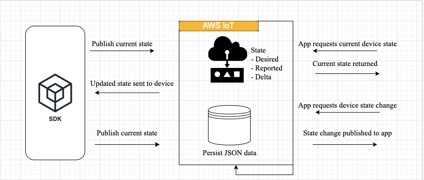
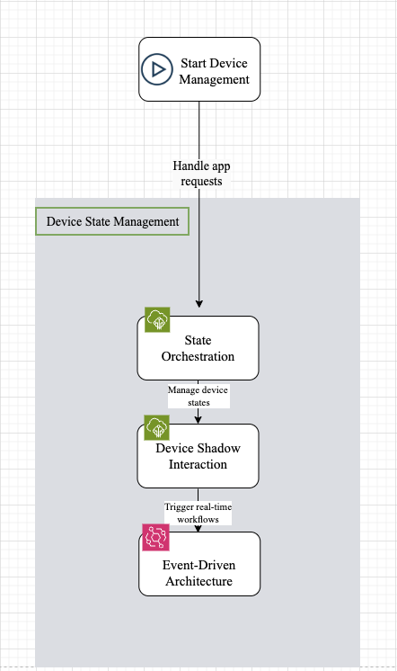

  

### Core Data Pipeline

  

Builds a scalable data pipeline for IoT devices by leveraging AWS services.

  

 - [ ] -> **Data Extraction**: Device SDK's API to extract raw IoT data.
- [ ] -> **Data Storage**: Orchestrate the data ingestion process using Apache Airflow, storing the extracted data in an S3 bucket.

- [ ] -> **Data Transformation**: Process and transform the raw data using AWS Glue and Amazon Athena.

- [ ] -> **Data Analytics**: Load the transformed data into Amazon Redshift for advanced querying and analytics.

- [ ] -> **AWS CDK**: Automate the infrastructure provisioning using AWS CDK.

- [ ] -> **EventBridge**: Trigger real-time workflows based on IoT events.

- [ ] -> **SageMaker**: Implement predictive analytics using Amazon SageMaker to provide machine learning insights on the transformed data.

---

### Device State Management

  

Enables management of IoT device states via AWS IoT Device Shadow.
 
  

- [ ] -> **State Orchestration**: Use the SDK to handle app requests for the current state or state changes, interacting with IoT device state management.

- [ ] -> **Device Shadow Interaction**: Implement state persistence using AWS IoT Device Shadow to manage the device’s desired, reported, and delta states.

- [ ] -> **Event-Driven Architecture**: Extend the system with AWS EventBridge and Lambda to trigger real-time workflows based on specific device state changes, such as threshold violations or status updates.

  

